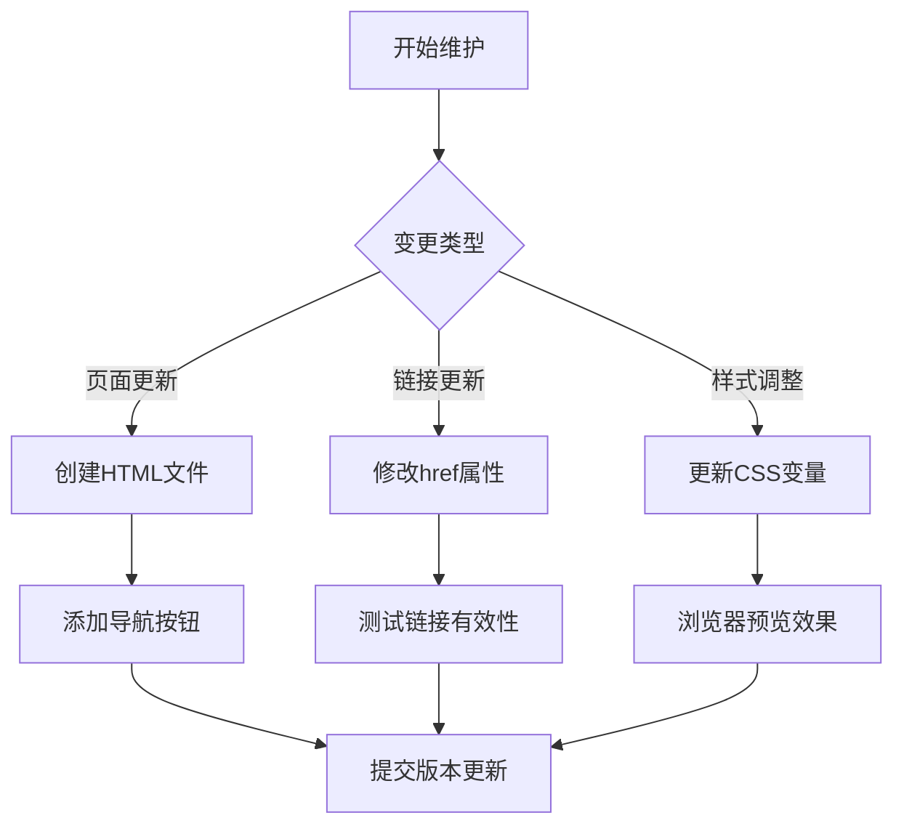

# xy-12306 个人导航网站

## 项目概述 📖
个人导航门户网站，包含：
- 智能导航看板系统
- 技术笔记直连通道
- 常用工具快速入口
- 响应式多设备适配

## 功能特性 ✨
✅ 多页面导航架构  
✅ 现代化渐变UI设计  
✅ 卡片式交互布局  
✅ 飞书文档集成  
✅ 第三方服务对接

## 技术栈 🛠️
```
HTML5 | CSS3 | JavaScript
├─ 响应式布局
├─ CSS变量系统
├─ 移动优先原则
└─ 渐进式增强
```

## 目录结构 📂
```
.
├── index.html            # 主门户
├── pages/                # 子页面
│   ├── page01.html       # 导航看板1
│   ├── page02.html       # 导航看板2
│   ├── page03.html       # 网页推荐
│   └── page04.html       # 球球导航
├── assets/               # 静态资源
│   ├── css/
│   │   ├── style.css     # 主样式
│   │   └── style01.css   # 辅助样式  
│   └── js/
│       ├── script.js     # 主逻辑
│       └── script01.js   # 扩展功能
└── README.md            # 项目文档
```

## 维护指南 🔧
### 维护流程图解 🗺️


### 标准化维护流程 📝
1. **页面管理**
   - 新增页面：使用标准化模板创建HTML文件
   ```html
   <!-- pages/模板页.html -->
   <!DOCTYPE html>
   <html lang="zh-CN">
   <head>
       <meta charset="UTF-8">
       <link rel="stylesheet" href="../assets/css/style.css">
   </head>
   <body>
       <!-- 页面内容区块 -->
       <div class="container"></div>
   </body>
   </html>
   ```

2. **样式配置**
   - 扩展CSS变量系统：
   ```css
   :root {
     /* 基础配置 */
     --primary-color: #1677ff;  /* 主品牌色 */
     --text-primary: rgba(0, 0, 0, 0.88); /* 主要文字 */
     
     /* 新增间距系统 */
     --space-sm: 8px;  /* 小间距 */
     --space-md: 16px; /* 中间距 */
   }
   ```

## 版本控制规范 🏷️
### 版本号规则
`主版本.次版本.修订版` 格式：
- **主版本**：架构级变更
- **次版本**：功能新增/优化  
- **修订版**：问题修复

### 更新日志模板
```markdown
## v1.2.0 - 2024-04-01
### ✨ 新增功能
- [导航] 新增AI工具导航看板
- [样式] 支持暗黑模式切换

### ⚙️ 优化改进
- 提升移动端卡片点击区域

### 🐛 问题修复
- 修复iOS Safari渐变渲染异常
```

### 链接管理
- 外部链接：修改对应card元素的href属性
- 内部跳转：使用锚点定位（例：#home）

### 样式定制
通过CSS变量系统快速修改主题：
```css
:root {
  --primary-color: #1677ff; /* 主色调 */
  --bg-gradient: linear-gradient(150deg, #f0faff 0%, #e6f2ff 100%);
}
```

## 开发建议 💡
1. 使用VS Code Live Server扩展进行本地预览
2. 修改样式后强制刷新缓存（Ctrl+F5）
3. 移动端测试建议分辨率：375x812（iPhone 12/13）

## 版本记录 📌
| 版本  | 日期       | 更新说明                 |
|-------|------------|--------------------------|
| v1.0  | 2024-03-15 | 基础导航框架搭建完成     |
| v1.1  | 2024-03-20 | 增加智能看板交互功能     |

> 🚀 项目托管于GitHub Pages：https://xy-12306.github.io